autoscale: true
build-lists: true
slide-dividers: #, ##
footer: inquiries@jonathan.industries
slidenumbers: true

# [fit] Bayesian Hyperparameter Optimization

Scaling AI Applications in Python with the Ray Framework

## Getting the Materials

[https://sr.ht/~hyphaebeast/ray-live-training/](https://sr.ht/~hyphaebeast/ray-live-training/)

## Introduction to Tuning Models

* Understanding the bias-variance trade-off
* Model Regularization
* Bruteforce Hyperparameter Optimization

---

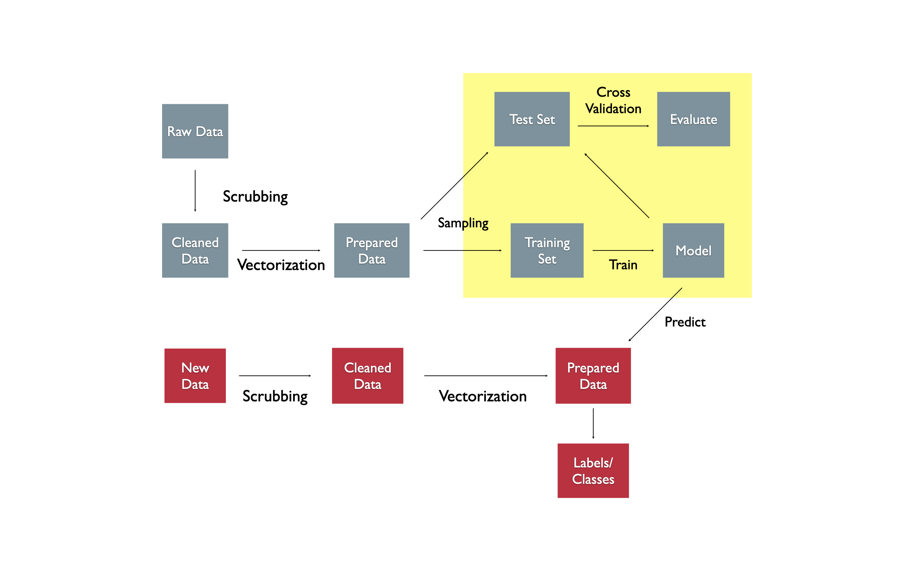

---

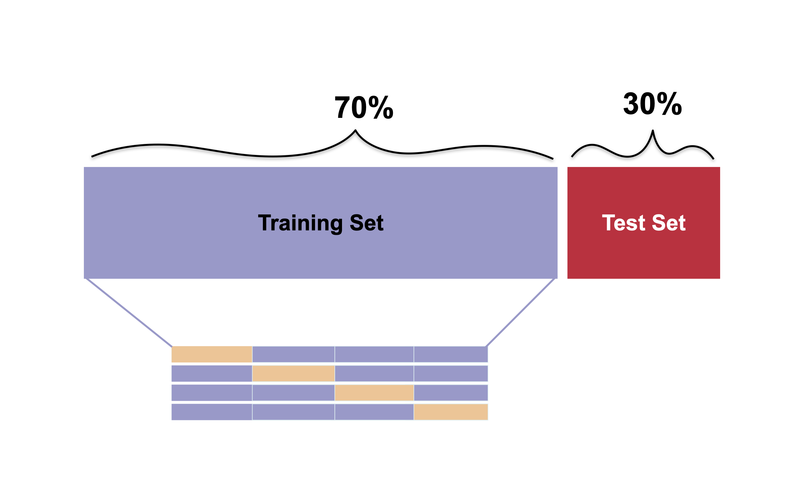

---

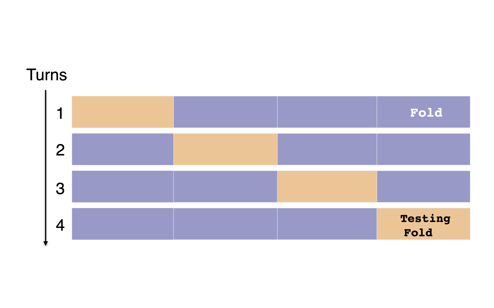

---

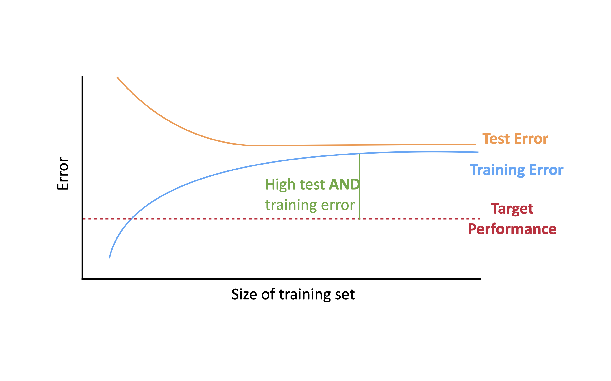

---

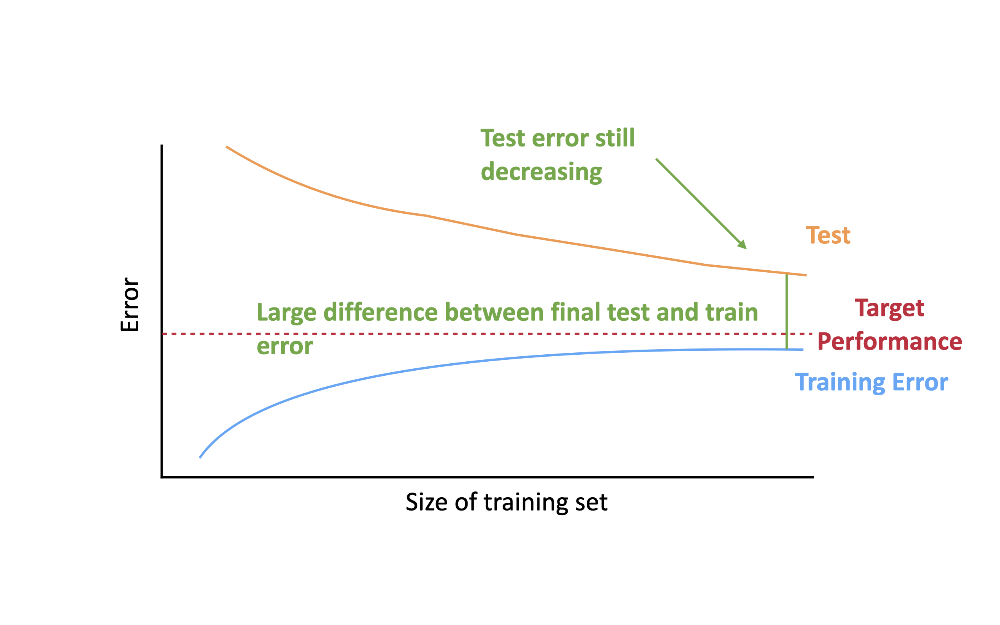

---

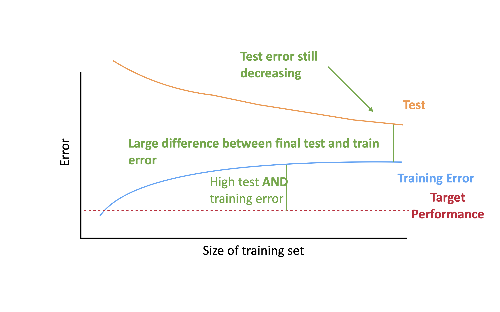

---

## [fit] Live Code

---

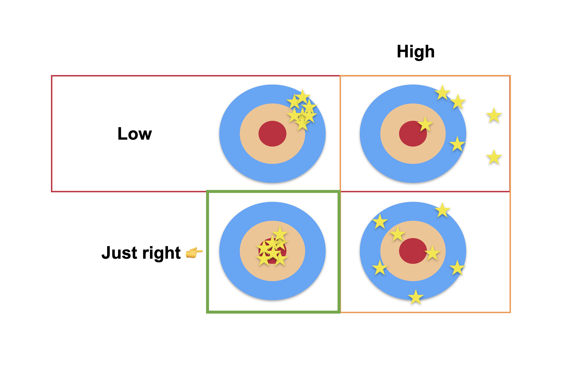

---

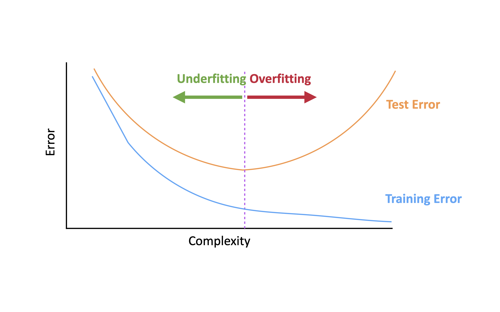

---

## [fit] Live Code

## Bayesian Hyperparameter Optimization

* Gaussian Processes Primer
* Introduction to Bayesian Optimization
* Sequential Optimization with Ax

## Why Bayesian Optimization?

* __Function__ costly to evaluate.
* No closed form but (noisy) sampling is possible.
* Non-convex problem.

## Why Bayesian _Hyperparameter_ optimization

* __Model__ expensive to evaluate (time, money, etc.)
* No closed form but (noisy) sampling is possible.
* Non-convex problem.

## 2 sides of general optimization

* Objective Function (what are you optimizing)
* Search function (in our case Bayesian Optimization)

## 2 (*additional*) sides of Bayesian Optmization

* Model of objective (approx. of response surface)
* Aquisition function (sampling strategy)

## BO pseudocode

[.column]

$$
\begin{align}
&\text{for} \; \; t = 1, 2, 3, \dots, T \; \; \text{do} \\
& \qquad x_t = \underset{x}{\arg\max} \; u(x | D_{1:t-1}) \\
& \qquad y_t = f(x_t) + \epsilon \\
& \qquad D_{1:t} = \{ D_{1:t-1}, (x_t, y_t) \} \\
& \qquad M_{t+1} = \underset{\theta}{\arg\max} \; M_t(\theta | D_{1:t}) \\ 
&\text{end for}
\end{align}
$$

[.column]
__T__ _steps of BO_

_optimize over_ __aquis. fn__

_evaluate_ __objective fn__

_update_ __model__

## [fit] Live Code

## From __OLS__ to _GP_

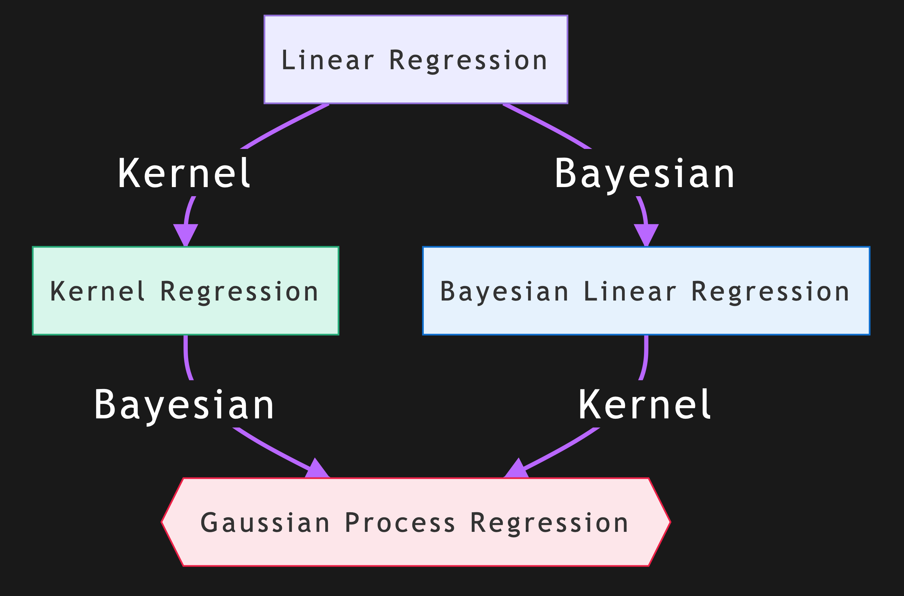

## Bayesian Kernalized Linear Regression

## Bayesian Regression with kernelized features

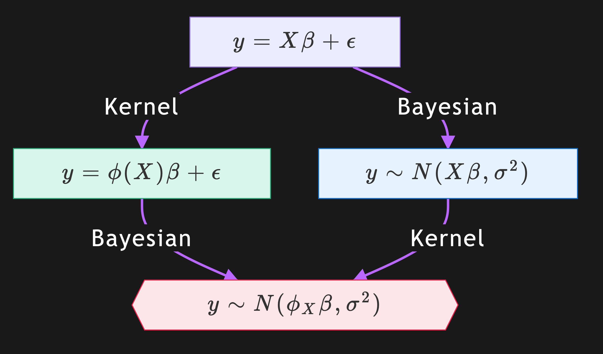

## Gaussian Process prior over function space

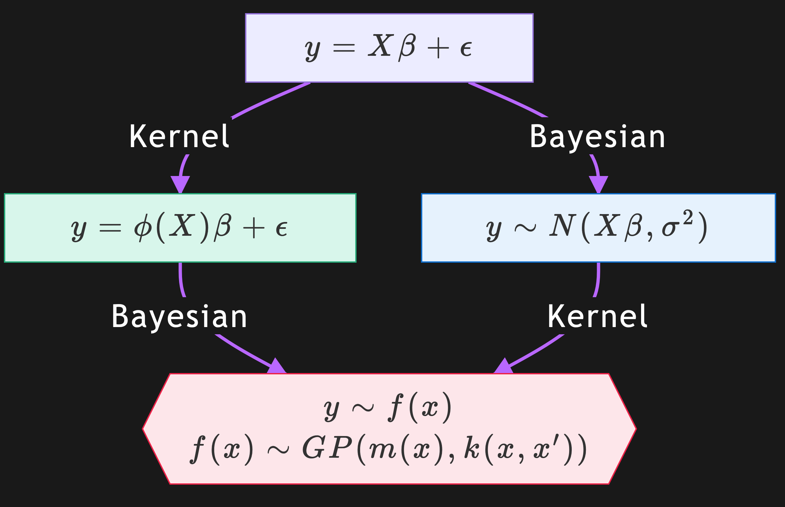

---

[.footer: Source: [https://arxiv.org/pdf/1012.2599.pdf](https://arxiv.org/pdf/1012.2599.pdf)]

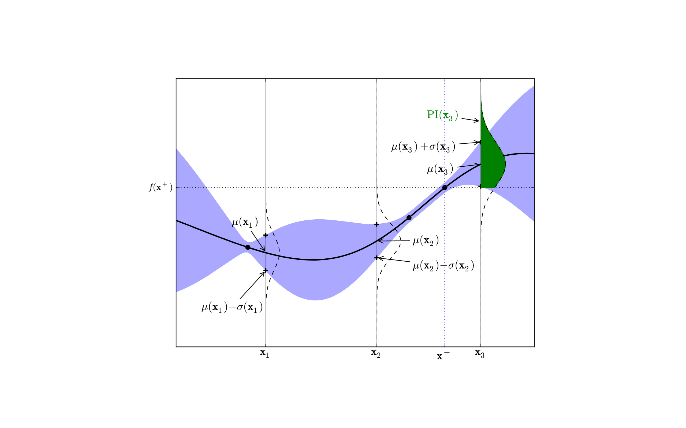

---

[.footer: Source: [https://arxiv.org/pdf/1012.2599.pdf](https://arxiv.org/pdf/1012.2599.pdf)]

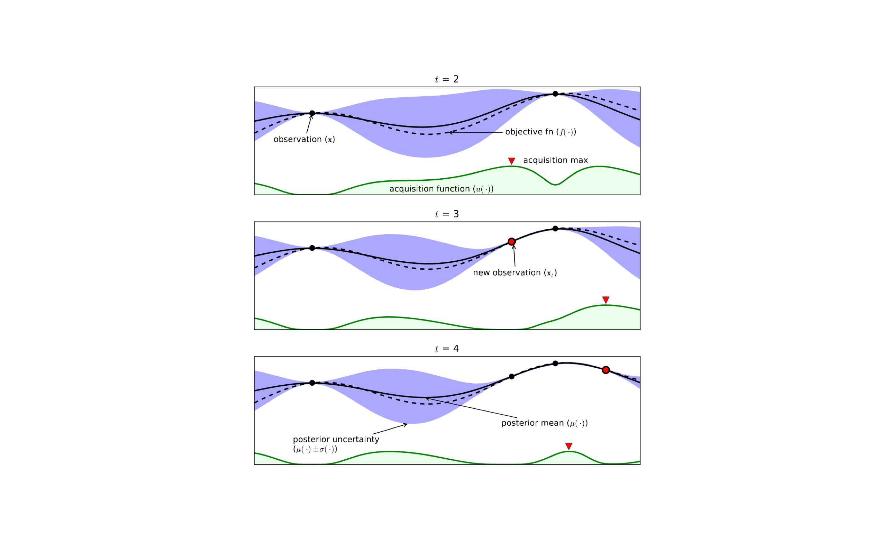

---

[.footer: Source: [https://ax.dev/tutorials/tune_cnn.html](https://ax.dev/tutorials/tune_cnn.html)]

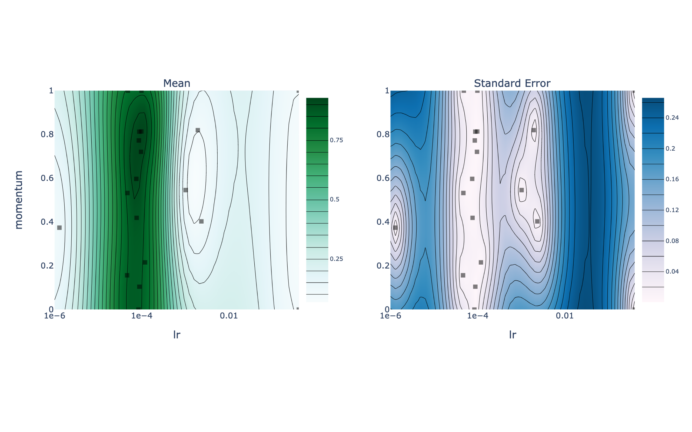

---

[.footer: Source: [https://ax.dev/tutorials/tune_cnn.html](https://ax.dev/tutorials/tune_cnn.html)]

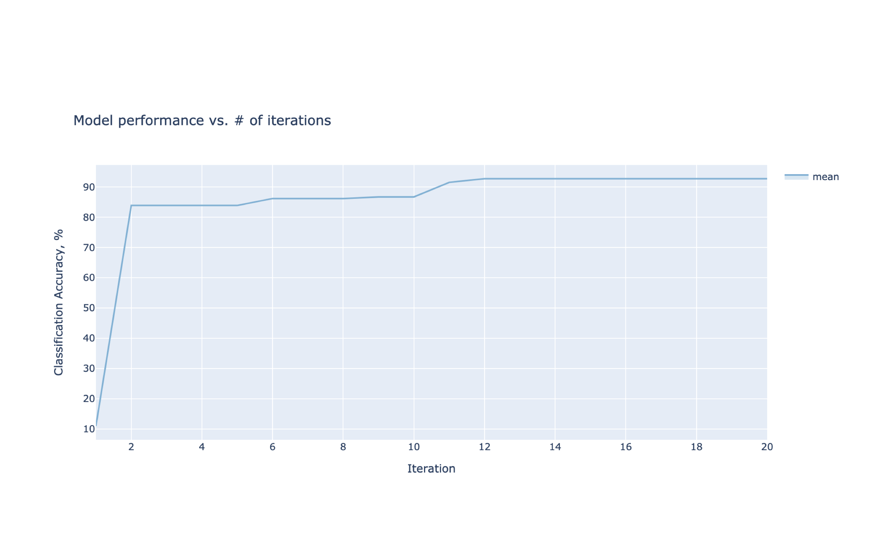

---

## Distributed Hyperparameter Optimization with Ray Tune

## [fit] Live Code

## Q & A

Materials, mailing list, questions, feedback 👇
[https://sr.ht/~hyphaebeast/ray-live-training/](https://sr.ht/~hyphaebeast/ray-live-training/)
